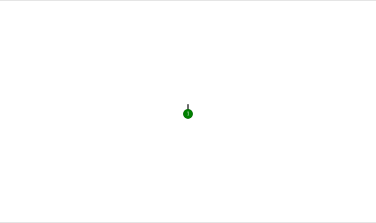

# fun with diagrams

Various bits of visualization code based on the [diagrams](http://projects.haskell.org/diagrams/) library.

## RemyVis

[RemyVis.hs](RemyVis.hs): generates an animation of [Remy's algorithm](https://fr.wikipedia.org/wiki/Algorithme_de_R%C3%A9my) for uniformly generating random binary trees:



## Luka

[Luka.hs](Luka.hs): some routines for visualizing Łukasiewicz paths:

```haskell
*Luka> walkSVG' 1 "U2DU1DDU1DD"
```


```haskell
*Luka> walkSVG' 1 "U1DU2DU1DDD"
```

