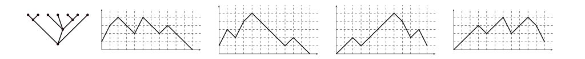

# fun with diagrams

Various bits of visualization code based on the [diagrams](http://projects.haskell.org/diagrams/) library.

## RemyVis

[RemyVis.hs](RemyVis.hs): generates an animation of [Remy's algorithm](https://fr.wikipedia.org/wiki/Algorithme_de_R%C3%A9my) for uniformly generating random binary trees:


## Luka

[Luka.hs](Luka.hs): some routines for visualizing generalized Łukasiewicz paths:

```haskell
*Luka> walkSVG' 1 "U2DU1DDU1DD"
```


```haskell
*Luka> walkSVG' 1 "U1DU2DU1DDD"
```


```haskell
*Luka> walkSVG' 0 "UUUD2UUD2UUUD2D2"
```


## LukaTree

[LukaTree.hs](LukaTree.hs): visualizing trees as paths.  (This uses routines for visualizing operadic trees from the [LinLam](https://github.com/noamz/linlam) library.)

Each tree is encoded as a Łukasiewicz path in four different ways, respectively via its preorder left-to-right, preorder right-to-left, postorder left-to-right, and postorder right-to-left traversals.

```haskell
> t = bin (bin (bin lea (bin lea lea)) lea) (bin (bin (bin lea lea) lea) (bin lea lea))
> renderPretty "binwalk.svg" (mkWidth 2048) (treeWalksDiagram t)
```


```haskell
> t = ter (bin lea lea) (ter lea lea (bin lea lea)) lea
> renderPretty "terwalk.svg" (mkWidth 1024) (treeWalksDiagram t)
```


```haskell
> renderPretty "allbin3walk.svg" (mkWidth 1024) (vsep 1 [treeWalksDiagram t | t <- kTree 2 3])
```

